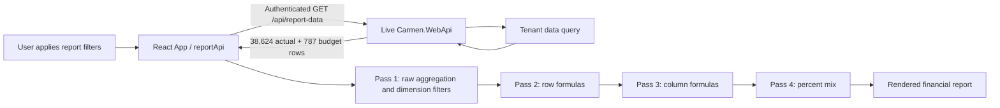

# Report Data Performance: Investigation and Implementation Plan

Status: frontend and backend source changes implemented; backend deployment and post-deploy timing pending  
Measured: 2026-08-17, authenticated local browser session  
Scope: View-mode report loading through `GET /api/report-data`

## Outcome

Report loading is materially slower than an interactive BI workflow should be. For the measured report, the API is the primary bottleneck and the browser-side calculation is a secondary bottleneck. The work should optimize both layers, while keeping the FRD v5.23 four-pass calculation result exactly unchanged.

The production-serving backend is `C:\dotnet\Carmen4\Carmen.WebApi`, reached by the frontend through `http://localhost/Carmen.WebApi`. `C:\source\Carmen.Report\ReportAPI` is not the live implementation for this investigation.

## Observed baseline

Scenario: `PL-PARESA-2`, year `2026`, period `2`, revision `0`, tenant `prod`.

| Measurement | Observed |
| --- | ---: |
| `GET /api/report-data` | ~11.9 s |
| Actual rows returned | 38,624 |
| Budget rows returned | 787 |
| Total financial rows returned | 39,411 |
| One `buildReportData` computation | ~1.3 s |
| Clean Apply, user-visible wait | ~16 s |
| First navigation, user-visible wait | ~25 s |

Development React StrictMode invoked the calculation twice. This is useful for finding unsafe code but is not itself evidence of two production computations. All acceptance measurements must therefore be repeated with a production build, with development StrictMode results reported separately.

These are point-in-time measurements, not p50/p95 statistics. Before and after comparisons must use the same report, filters, tenant, data version, browser, and backend deployment.

## Implemented result

### Frontend

- Pass 1 now normalizes source rows once, compiles dimension sets once per report row, reuses mapping-matched subsets across source columns, and skips the former wasted actual calculation for budget columns.
- Passes 2-4 remain in their original order and retain their existing formula and percentage behavior.
- The representative fixture now matches the live report shape: 38,624 actual rows, 787 budget rows, 83 report rows, 16 columns, 206 mapped accounts, 27 departments, and 16 dimension-mapped rows.
- Deterministic fixture timing improved from 10,675.7 ms before the change to 94-109 ms after the change (about 98x faster). The regression budget is less than 750 ms to tolerate CI variance.
- Frontend verification: 126/126 Vitest tests passed, production build passed, and React Doctor scored 100/100.

### Backend

- The live backend source at `C:\dotnet\Carmen4\Carmen.WebApi` now derives conservative account and department unions from the report definition and adds indexed `WHERE IN` predicates to `VGlHis`, `VGlJv`, and `VBudget`.
- Pruning is enabled only when every data row has explicit mappings. A report containing an unbounded row or department-group fallback retains the previous unfiltered query.
- Numeric mappings are resolved through authoritative AccountCode and Department master data before querying. This preserves frontend equivalence such as mapping `4001` to raw `0004001`; unresolved or ambiguous numeric mappings disable that pruning dimension.
- Applying the verified account and department unions to the old response predicts actual rows falling from 38,624 to 11,070 (-71.3%) and budget rows from 787 to 627 (-20.3%), without removing any row eligible for the current mappings.
- Backend planner verification: linked-source test project built and 9/9 xUnit tests passed, including zero-padded, decimal-suffixed, ambiguous, missing, and punctuation/range tokens.

The legacy WebApi project builds successfully with the Visual Studio Community MSBuild installation that includes `Microsoft.WebApplication.targets`; the earlier BuildTools-only attempt used an incomplete toolchain. No IIS deployment was performed, so authenticated post-change API and end-to-end timings remain an explicit release gate rather than a claimed result.

## Request path and cost shape

The current client deduplicates an identical read only while it is in flight. It does not provide a completed-response cache or a client timeout. Pass 1 repeatedly evaluates raw financial rows across data rows and data columns, so its cost grows with report mappings, columns, and returned transaction rows.

## Ranked, falsifiable hypotheses

1. **Backend query and materialization dominate.** The API alone takes ~11.9 s. Prediction: server timing will show database execution and/or result materialization consuming most of the request; response download will be smaller.
2. **The raw response is wider or larger than the report needs.** Returning 39,411 rows increases database transfer, JSON serialization, network transfer, parsing, and memory pressure. Prediction: projected fields and safe server-side filters reduce response bytes and API duration without changing report output.
3. **Pass 1 repeatedly scans the same rows.** A single browser computation takes ~1.3 s. Prediction: normalize and index the dataset once, then query candidate buckets per mapping; production calculation time falls while Passes 2-4 remain byte-for-byte or cent-for-cent equivalent.
4. **Cold-start and navigation work add substantial non-report time.** First navigation is ~25 s versus ~16 s for a clean Apply. Prediction: request-level timing will expose cold backend initialization, report definition/master-data requests, or initial application work outside `report-data`.
5. **Development-only duplicate calculation exaggerates local observations.** StrictMode calls the computation twice. Prediction: a production bundle performs one calculation per stable input and records lower total main-thread time, while API time remains similar.

## Target acceptance criteria

FRD v5.23 states: process 5,000 rows in less than 100 ms. Because it does not define whether this includes network and database time, the project must preserve that requirement as an **engine-processing target** and separately measure end-to-end experience. It must not be silently reinterpreted as an end-to-end SLA.

| Stage | Dataset and path | Acceptance target |
| --- | --- | --- |
| Measurement gate | Current 39,411-row scenario | Record at least 10 warm and 3 cold runs; report p50, p95, row count, response bytes, API phases, calculation time, and user-visible time |
| Stage 1 | Current scenario | API p95 <= 3 s; one production calculation p95 <= 500 ms; clean Apply p95 <= 5 s |
| Stage 2 | Current scenario | API p95 <= 1.5 s; one production calculation p95 <= 250 ms; clean Apply p95 <= 2.5 s |
| FRD gate | Deterministic 5,000-row engine fixture | Four-pass engine p95 < 100 ms in a production build on the agreed reference machine |
| Accuracy gate | All golden scenarios | Exact mapping membership and formula behavior; financial totals equal to the approved baseline at displayed accounting precision |

Cold first navigation should be tracked independently and should reach p95 <= 5 s after the report path meets Stage 2. A target may be tightened after instrumentation identifies the backend lower bound; it may not be relaxed merely to match current behavior.

## Work ownership

| Owner | Repository | Work |
| --- | --- | --- |
| Backend | `C:\dotnet\Carmen4\Carmen.WebApi` | Add phase timings and correlation IDs; inspect query plans; verify tenant/year/period/revision/department predicates; minimize projected fields; remove avoidable materialization; validate indexes; add safe compression and cache/invalidation where justified |
| Frontend | `C:\source\carmen.financial` | Add production timing marks; normalize each response once; replace repeated list membership checks with indexed/set lookups; reuse candidate buckets across cells; memoize only on complete report/filter/data keys; cancel superseded reads; prevent stale responses from winning |
| Shared | Both | Define request/cache keys, row schema, source-data version, accuracy fixtures, performance fixtures, dashboards, staged rollout, and rollback triggers |

### Backend implementation notes

- Instrument authentication, tenant resolution, database execution, materialization, mapping/report metadata lookup, serialization, response size, and total duration before changing the query.
- Run the actual execution plan for the measured scenario. Index decisions must follow observed predicates and cardinality, not guesses.
- Keep **Auth Before Query** and tenant isolation. Cache keys must include tenant and every result-affecting filter; cached data must never cross tenant or authorization boundaries.
- Prefer safe projection and filtering first. Server-side aggregation is allowed only after proving that it preserves arbitrary account/group/department/dimension mappings and all time modes required by the report.
- If caching is introduced, include a source-data/report-definition version or reliable invalidation for GL, Budget, mapping, revision, and report changes.

### Frontend implementation notes

- Benchmark the production bundle. Development StrictMode timing remains diagnostic only.
- Preserve the public output of `buildReportData` while optimizing Pass 1. Build normalized keys once and indexes from the immutable response rather than normalizing strings inside each cell scan.
- Candidate selection may use year, revision, department, account code, group level/value, dimensions, and time buckets, but the final predicate must preserve existing AND/override behavior.
- Keep the four-pass order. Do not combine formula or percentage evaluation into aggregation merely for speed.
- Response caching must use the complete tenant/report/year/period/day/revision/department key plus a data version or a bounded freshness/invalidation policy. Superseded requests should be aborted or ignored safely.

## Four-pass accuracy risks

Performance work is blocked from rollout if any of these semantics change:

- Pass order remains raw aggregation -> row formulas -> column formulas -> percent mix.
- Account, department, department-group, group-level, and multi-dimension mappings preserve current AND behavior and explicit account override rules.
- Actual and budget data remain separated correctly; budget revision modes and parameter/specific revision behavior remain intact.
- DAC, PTD, AC, ACC, DACBG, PTDBG, BC, and BCC preserve daily, period, month, brought-forward, and YTD semantics.
- Year/period/day parameter modes, previous-period boundaries, quarters, and specific values remain correct.
- Negative values, parenthesized amounts, commas, nulls, blanks, and zero values normalize identically.
- Row and column formulas preserve `R#`, `C#`, missing-reference, divide-by-zero, and percent-base behavior.
- Floating-point accumulation order can change cents. Compare both raw results and displayed accounting precision; use a documented decimal strategy if exact financial equality cannot be maintained with reordered sums.
- Cache invalidation must cover report setup, mappings, GL/Budget imports or updates, revision changes, and tenant changes.

## Verification matrix

| Area | Cases | Required assertion |
| --- | --- | --- |
| Baseline report | PL-PARESA-2 / 2026 / P2 / Rev0 | Every visible cell, subtotal, total, and percent matches the saved pre-change result |
| Data volume | 0, 1, 5,000, ~39,411, and larger stress fixture | Correct result; p50/p95 and peak memory recorded |
| Mapping | Account, account group L1-L4, department, department group, duplicate codes, explicit overrides | Same transaction membership and totals |
| Dimensions | No dimension, Dim1, Dim2, Dim1 + Dim2 | Multi-dimension selection remains AND |
| Time | Daily, PTD, monthly, YTD, previous period/year, Q1-Q4, year boundary | Same period inclusion and totals |
| Budget | Parameter Rev0-4 and specific revision | Same budget rows and totals; no actual/budget crossover |
| Formula passes | Row formulas, column formulas, nested references, `% Base`, zero base, missing reference | Same pass order, values, and error behavior |
| Request lifecycle | Rapid filter changes, identical concurrent reads, navigation away, timeout/error, retry | No stale result overwrite, duplicate active read, or stuck loading state |
| Security | Multiple tenants and users with different access | Auth occurs before query; no cache or response leakage |
| Product regression | VIEW/SETUP, export, print, persistence | Existing flows remain usable and output matches the displayed report |

Golden fixtures should store normalized inputs, report configuration, intermediate output after each pass, and final displayed values. Run the old and optimized engines against the same immutable inputs in CI until the optimized path is proven.

## Observability

- Generate a request/correlation ID and return it to the browser.
- Emit structured backend timings for auth, tenant resolution, query, materialization, serialization, and total duration, plus actual/budget row counts and response bytes. Never log access tokens or financial row contents.
- Add `Server-Timing` headers where feasible so browser and backend measurements correlate.
- Record frontend marks for request start/end, JSON parse completion, calculation start/end, render-ready, and stale/aborted requests.
- Dashboard p50/p95/p99, error rate, timeout rate, cache hit rate, row counts, response bytes, and calculation duration by tenant/report class without exposing financial values.
- Alert initially when API p95 exceeds 3 s, clean Apply p95 exceeds 5 s, accuracy comparison fails, or cross-tenant cache-key checks fail.

## Rollout and rollback

1. Land instrumentation first and capture the measurement gate.
2. Add backend query/projection changes behind an independently reversible feature flag.
3. Add the frontend indexed engine behind a separate flag and dual-run it in non-production or sampled shadow mode against the current engine.
4. Promote only after the verification matrix and accuracy gate pass. Roll out by tenant or report cohort while watching latency, errors, memory, and result mismatches.
5. On mismatch, security concern, elevated errors, or regression beyond the current staged limit, disable the affected flag and return to the raw API/current engine. Do not require a data rollback.
6. Keep diagnostic metrics through the rollback so the failed path can be reproduced. Purge any cache whose key or invalidation is suspected.

## Definition of done

- Measurement gate, Stage 2, FRD performance gate, and four-pass accuracy gate pass in documented environments.
- Backend and frontend timings reconcile through a correlation ID.
- No tenant/auth regression and no stale-cache result is observed.
- VIEW, SETUP, export, print, and persistence regression checks pass.
- Feature flags and rollback instructions are exercised once before full rollout.
